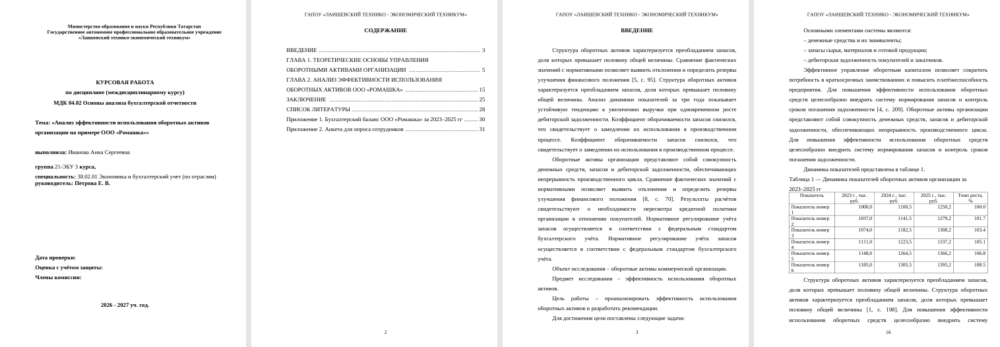
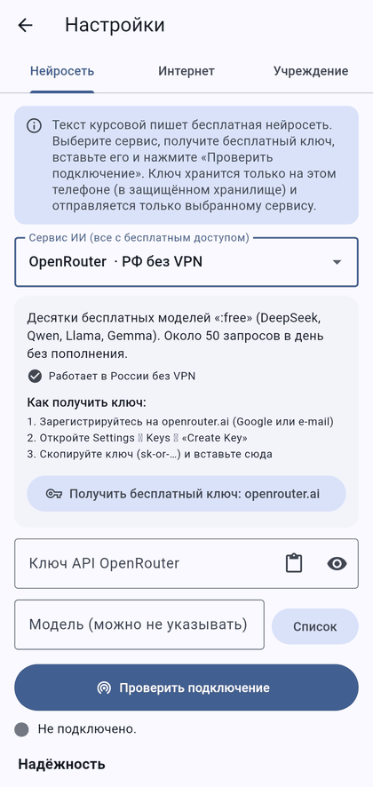
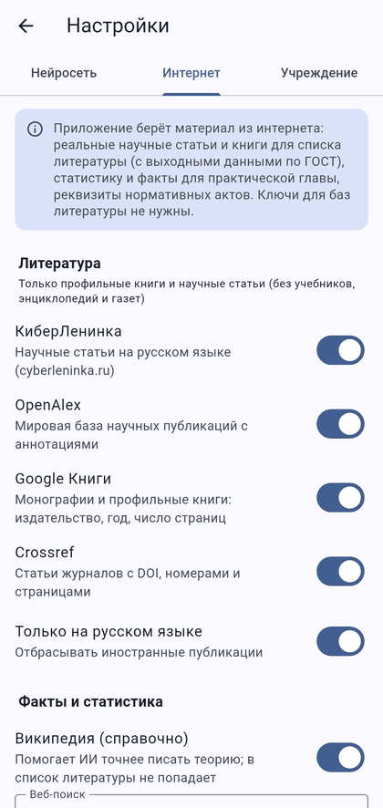
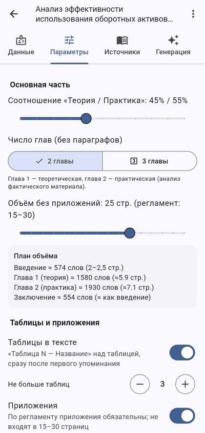
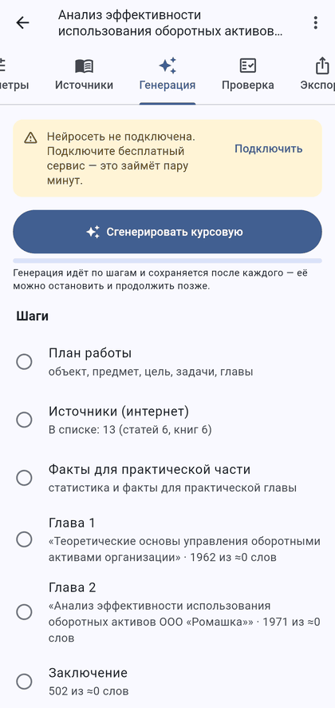

# Курсовая ЛТЭТ

Мобильное приложение (Flutter, Android и iOS) для написания курсовой работы строго по
«Положению о правилах написания и рецензирования курсовых работ в ГАПОУ «Лаишевский
технико-экономический техникум»». Текст пишет бесплатная нейросеть, литература и факты
берутся из интернета, документ сразу оформлен по регламенту и выгружается в Word или PDF.



## Установка на Android

1. Скачайте APK: **[Kursovaya-LTET.apk (последняя сборка)](https://github.com/Rentw1/raspis/releases/tag/kursovaya-latest)** —
   раздел Releases → `kursovaya-latest` → файл `.apk`.
2. Откройте файл на телефоне и разрешите установку из этого источника.
3. Android 7.0 и новее. Новые версии ставятся поверх старых — курсовые и ключи сохраняются.

iPhone: в том же выпуске лежит неподписанный `.ipa` — его можно установить через AltStore/Sideloadly
со своим Apple ID (или собрать проект в Xcode).

## Как пользоваться

| Шаг | Что делать |
| --- | --- |
| 1. ИИ | Настройки → «Нейросеть» → выбрать сервис → **«Получить бесплатный ключ»** → вставить ключ → **«Проверить подключение»** (зелёный — подключено, красный — ошибка авторизации / запрос отклонён) |
| 2. Данные | Тема, ФИО, группа, курс, специальность, дисциплина, руководитель; по желанию — организация и цифры для практической главы |
| 3. Параметры | Ползунок «Теория / Практика», 2 или 3 главы, объём 15–30 страниц, таблицы и приложения, интернет-источники |
| 4. Источники | «Найти в интернете» — реальные статьи и книги с выходными данными; можно отметить, убрать, добавить вручную |
| 5. Генерация | План → главы частями → заключение → **введение (после основной части)** → приложения; можно остановить и продолжить |
| 6. Проверка | Чек-лист негативных критериев п. 6.2 регламента, прогноз оценки, автоисправления, рецензия ИИ по форме ПРИЛОЖЕНИЯ 3 |
| 7. Экспорт | Word (.docx) или PDF, предпросмотр, «Открыть», «Поделиться», «Сохранить в…» |

<p>
 
 
</p>

## Бесплатные нейросети

| Сервис | Что даёт | Ключ |
| --- | --- | --- |
| OpenRouter | бесплатные модели `:free` (DeepSeek, Qwen, Llama, Gemma); работает в РФ | openrouter.ai/settings/keys |
| GitHub Models | GPT-4.1, DeepSeek, Llama с аккаунтом GitHub; работает в РФ | токен с правом «Models: Read» |
| Hugging Face | открытые модели, ежемесячный лимит; работает в РФ | huggingface.co/settings/tokens |
| GigaChat (Сбер) | бесплатный лимит для физлиц; работает в РФ; нужен сертификат НУЦ Минцифры (gosuslugi.ru/crt) | developers.sber.ru/studio |
| Google Gemini | сильные модели Flash + поиск Google для фактов; из РФ может понадобиться VPN | aistudio.google.com/apikey |
| Groq, Mistral, Cerebras | быстрые бесплатные модели; из РФ может понадобиться VPN | консоли сервисов |
| Pollinations | бесплатные кредиты | enter.pollinations.ai |
| DeepSeek | недорогой платный API | platform.deepseek.com |
| Свой сервер | любой OpenAI-совместимый адрес `https://…/v1` | — |

Модель подбирается автоматически (или выбирается из списка). При лимите бесплатных запросов (429)
приложение повторяет запрос, переключается на другую бесплатную модель и, если задан, на запасной сервис.
Ключи хранятся только на телефоне в защищённом хранилище (Keychain / Android Keystore).

## Что берётся из интернета

- **Литература**: КиберЛенинка, OpenAlex, Google Книги, Crossref — реальные статьи и книги с авторами,
  журналом, годом, номером и страницами; ИИ отбирает самые подходящие. Учебники, энциклопедии, словари
  и газеты отсекаются (требование регламента). Список — по алфавиту, описания по ГОСТ 7.1-2003.
- **Нормативные акты**: реквизиты проверяются веб-поиском (consultant.ru, garant.ru, pravo.gov.ru).
- **Факты для практической главы**: веб-поиск (DuckDuckGo без ключа, либо Tavily/Brave/SearXNG),
  чтение найденных страниц, выписка цифр со ссылками; для Gemini — поиск Google.
- **Википедия** — только справочный контекст для ИИ (в список литературы не попадает).

## Оформление документа (как в регламенте)

- А4, поля: левое 30 мм, правое 10 мм, верхнее 20 мм, нижнее 20 мм.
- Times New Roman 14, по ширине, абзацный отступ 1,25 см, интервал 1,5; в таблицах — 12 пт, интервал 1,0.
- Заголовки по центру, без точки, подчёркивания и переносов; 2 интервала до текста; каждая структурная
  часть с новой страницы; главы без параграфов.
- Верхний колонтитул со 2-й страницы: «ГАПОУ «ЛАИШЕВСКИЙ ТЕХНИКО - ЭКОНОМИЧЕСКИЙ ТЕХНИКУМ»»;
  номер страницы внизу по центру без точки; титульный лист входит в нумерацию, но номер на нём не ставится.
- Титульный лист по ПРИЛОЖЕНИЮ 4; содержание с номерами страниц; «Таблица N — Название» слева над
  таблицей, при переносе — «Продолжение таблицы N»; приложения с новой страницы, «Приложение N» справа;
  место для подписи автора на последней странице.

PDF и DOCX верстаются одинаково: в PDF используется Liberation Serif — шрифт с метриками Times New Roman,
поэтому переносы и номера страниц в оглавлении совпадают с документом Word.

## Сборка

```bash
flutter pub get
flutter test            # 29 тестов: разметка, ГОСТ, клиент ИИ, парсеры баз, вёрстка DOCX/PDF, экраны
flutter build apk --release
flutter build ios --release --no-codesign
```

APK подписывается ключом `android/app/kursovaya-release.jks` (пароли в `android/key.properties`), чтобы
обновления ставились поверх. Для публикации в магазинах замените его своим ключом.
Сборка на GitHub Actions: `.github/workflows/kursovaya.yml` — после каждого изменения APK выкладывается
в выпуск `kursovaya-latest`.

## Устройство кода

| Папка | Назначение |
| --- | --- |
| `lib/core` | константы регламента, хранилище, сеть, утилиты текста и JSON |
| `lib/ai` | каталог бесплатных сервисов, клиент ИИ (поток, повторы, смена модели, GigaChat OAuth), промпты |
| `lib/search` | OpenAlex, КиберЛенинка, Crossref, Google Книги, Википедия, веб-поиск, чтение страниц |
| `lib/gen` | план, бюджет объёма, пошаговая генерация, разбор ответа ИИ |
| `lib/export` | модель документа, ГОСТ 7.1-2003, вёрстка PDF, запись DOCX, титульный лист |
| `lib/qa` | проверка по регламенту, прогноз оценки, автоисправления |
| `lib/ui` | экраны |

Текст создаётся ИИ как черновик: перед сдачей прочитайте работу, проверьте факты, цифры и источники.
